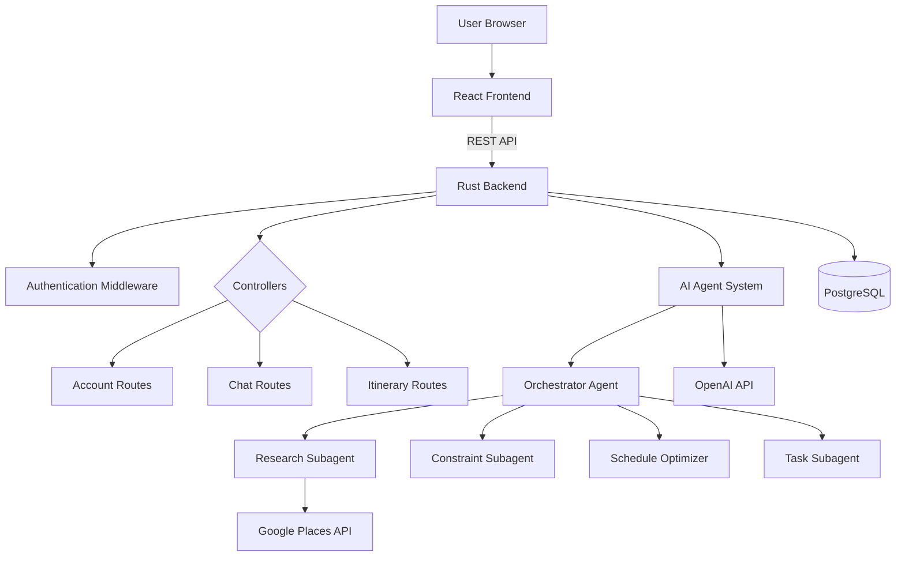

# Journey

## Team Members

| Name | Role | Email |
|------|------|--------|
| Ethan Morton| Backend Developer |Ethan.Morton1@marist.edu|
| Christian Farrell | Backend Developer |Christian.Farrell1@marist.edu|
| Gabrielle Knapp | Project Manager / Frontend Developer |Gabrielle.Knapp1@marist.edu|
| Nick Longo | Project Manager / Frontend Developer|Nicholas.Longo2@marist.edu|
| Peter Arvanitis | Frontend / Backend Developer |Peter.Arvanitis1@marist.edu|
| Juan Arias | Faculty Advisor |Juan.Arias@marist.edu|

---

## Table of Contents
- [Project Overview](#project-overview)
- [Background and Research](#background-and-research)
- [System Design and Architecture](#system-design-and-architecture)
- [Data Design](#data-design)
- [Implementation Details](#implementation-details)
- [Testing and Quality Assurance](#testing-and-quality-assurance)
- [Deployment](#deployment)
- [Results and Evaluation](#results-and-evaluation)
- [Lessons Learned](#lessons-learned)
- [Future Work](#future-work)
- [References](#references)
- [Acknowledgments](#acknowledgments)
- [Project Timeline](#project-timeline)

---

## Project Overview

### Abstract

Journey is for everyone. Parents, college students, pet-enthusiasts, business people, ravers, hikers, history-buffs, and people travelling with disabilities. Our adventure is in perfecting your adventure, squeezing in all of your must-sees and avoiding your must-nots while staying on budget and in-timeline, showing you corners of a place you might never have seen otherwise.

Welcome to Journey, where people-powered reviews and insights fuel an AI-engineered travel tool designed to put together your dream vacation. Give us all your specifics. Flying to Tokyo with your twin toddlers and wife with a gluten allergy? That's our thing. Road trip to Maine with your brother who hates highways and can't smell lobster without puking? That's our thing. Only in Peru for five days and you want to hike Machu Picchu but also see the Atacama while staying on a tight budget? That's. Our. Thing.

Journey is an interactive website that allows you to create an account and fill out static information that will remain the same across all of your trips-- accessibility information, food preferences or limitations, your risk tolerance, and your generalized budget. These will always be accessible to change from your account page. You are then able to create an itinerary for any trip by conversing with an AI-powered agent which will generate an itinerary with activities that match your preferences. You can dive into that itinerary to swap around events, create events of your own, and make changes by chatting with the agent again. Your itineraries are saved in the accounts page and the chats are always accessible!

Journey is built for you. Powered by reviews and experiences from people all over the world, we offer you an all-in-one travel planner to build your perfect vacation, honeymoon, or work-trip itinerary.

### Motivation

All of our team members are avid travelers, we love being spontaneous and exploring new areas. We founded Journey because we all felt like we were lacking an all-in-one tool to plan out an itinerary for weekend trips or spring break adventures. We appreciate the power of AI to consider individual preferences, but wanted to match that with reviews from fellow travelers, which is why we integrate google maps data and reviews into our itinerary-design system. Our goal is that Journey can help you personalize your travel plans to enhance your adventures and make the most of your trips.

### Objectives

Dynamic travel itinerary creation
- Full itineraries created by AI agent
- Ability for users to delete, add, and edit events on their own
- Itineraries will be stored and accessible to view and edit while saved in account
- Itineraries created will consider the static user information available in the account, passed through the system prompt, as well as the individual user prompt with trip-specific needs and details

Personalized account environment
- Create account & Login features integrated into index page
- Prompt users to complete account information upon account creation and later if not completed
- Store static, unchanging user information in Account including accessibility needs, food preferences, risk tolerance, and general budget preferences, with ability to change as needed
- Profile picture included in the account which track to each page the user visits

Streamlined, Responsive, & Accurate AI Agent interactions
- Users will be able to converse with AI-powered agent
- Saved account preferences will be passed in the system prompt
- Users will be able to submit a natural language prompt describing their desired trip, and the LLM will use this to generate an itinerary which will be displayed
- Agent will listen to feedback and comments from users to make edits to the itinerary without starting from scratch, only changing the desired parts of the itinerary
- LLMs will be directed to use specific Api tools, especially Google Maps and Google Reviews, which will provide the activities & events provided in the itinerary

### Scope

The itineraries created in this platform are limited to solely event cards, and will not include accommodation or flights, and will only include food if the user prompts that they are interested in finding restaurants. In our prototype we are directing the LLM to especially take activities and events from the Google api to ensure that the data is more accurate and controlled. Users are not able to export their itineraries or share with friends integrated in the site, although these are both features we are interested in expanding into. This is designed to be a streamlined and complete process for users to create an account, store static information, chat with an agent to create an activity-centered itinerary, and then edit said itinerary with events of their own, asking the agent to change what events they desire. The delivered product to the user will be a day-by-day guide to their destination, with personalized activities and events to keep them busy and allow them to take full advantage of their trip.

---

## Background and Research

## Background and Research

### Existing Solutions

The travel planning landscape includes several established platforms, each with distinct limitations that Journey addresses:

**TripAdvisor and Google Travel** provide extensive reviews and booking capabilities but lack intelligent itinerary generation. Users must manually compile activities into a cohesive schedule, often requiring multiple tools and significant time investment.

**TripIt and Roadtrippers** offer itinerary organization features but operate primarily as passive storage systems. They do not generate personalized recommendations or adapt to individual accessibility needs and preferences.

**AI Travel Assistants** like Wanderlog and Tripnotes have emerged with basic AI features, but typically focus on singular aspects such as booking or recommendations, rather than comprehensive day-by-day itinerary creation with real-time editing capabilities.

### Research Foundation

Our multi-agent architecture draws from established AI agent design patterns. Research in multi-agent systems demonstrates that task delegation to specialized sub-agents improves output quality and reduces computational overhead compared to monolithic AI systems [1].

The integration of real-time API data with LLM reasoning builds on recent work in retrieval-augmented generation (RAG), where external data sources enhance AI model accuracy and reduce hallucination [2]. By directing our agents to query Google Places API for current venue data, we ensure itineraries reflect actual availability, hours, and accessibility features.

Studies in personalized recommendation systems show that incorporating persistent user preferences significantly improves user satisfaction and reduces planning friction [3]. Journey's approach of storing static preferences (dietary restrictions, accessibility needs, budget tolerance) aligns with these findings while extending beyond typical recommendation systems to comprehensive trip planning.

### Key Gaps Addressed

1. **Fragmented Planning Process**: Existing tools require users to juggle multiple platforms for research, organization, and booking. Journey consolidates the activity planning phase into a single conversational interface.

2. **Limited Accessibility Integration**: While some platforms note accessibility features, few integrate these considerations directly into itinerary generation. Journey's constraint checking subagent filters activities based on user-specified accessibility needs from the outset.

3. **Static Itineraries**: Traditional planners produce fixed schedules that require manual reconstruction when changes are needed. Journey enables both conversational refinement and drag-and-drop editing without regenerating the entire plan.

4. **Lack of Context Awareness**: Most AI assistants treat each query independently. Journey's orchestrator agent maintains conversation context and itinerary state, allowing for iterative improvements based on user feedback.

### References

[1] Stone, P., & Veloso, M. (2000). Multiagent systems: A survey from a machine learning perspective. *Autonomous Robots*, 8(3), 345-383.

[2] Lewis, P., et al. (2020). Retrieval-augmented generation for knowledge-intensive NLP tasks. *Advances in Neural Information Processing Systems*, 33, 9459-9474.

[3] Ricci, F., Rokach, L., & Shapira, B. (2015). Recommender systems handbook. *Springer*.

---

## System Design and Architecture

### Functional Requirements

**FR1** - Organizer agent will play as center controller. It will manage context, dictate sub-tasks, handle clarification, and merge outputs. It is responsible to parse user input, manage conversation memory & database context, delegate tasks to sub-agents, validate partial outcomes, loop back to the user if necessary information is missing, and consolidate the final results.

**FR2** - A research & data subagent will gather all information needed to build the itinerary. It will query the database for existing information, Fetch POIs via APIs, expand the search based on location, budget, and preferences. The output will be a list containing structured event candidates.

**FR3** - A constraint & feasibility subagent is responsible for determining which events are realistically possible. It will check open/close times, whether bookings are required, and it will filter events based on budget, risk, and accessibility preferences. It will reject unfeasible events and mark feasible ones, outputting this filtered & marked list.

**FR4** - The schedule optimizer subagent is responsible for creating the actual itinerary using the feasible events. It will rank the possible events by user preferences, proximity, and diversity of the activities. For example, we don't want to have mostly museums or only Italian restaurants. It will build a day-by-day schedule, filling time blocks of morning/afternoon/evening, designed to minimize travel and maximize enjoyment. It will output the complete itinerary into our DB structure.

**FR5** - The completed itinerary will be editable, both through discussion with the AI Organizer agent and through manual maneuvering to complete events, delete events, and edit event details & time. The organizer agent will edit the itinerary in accordance with the user's remarks, not building from scratch, but only changing what is necessary.

**FR6** - The user will input at a minimum the travel destination, approximate date range of travel, approximate budget, and the number of travelers on the trip

**FR7** - The user will be able to provide in the account page their comfort-level with risk and adventurous activity. This will always be passed to the Organizer & Data agent within the system prompt and will be strictly followed. This information can be edited in the account page.

**FR8** - The user will be able to provide accessibility & food preferences within the account page. This will always be passed to the Organizer & Data agent within the system prompt and will be strictly followed. This information can be edited in the account page.

**FR9** - The user will be able to provide general budget guidelines in the account page. This will always be passed to the Organizer & Data agent within the system prompt but can be overridden in the user prompt if desired. This information can be edited in the account page.

**FR10** - The task-specific agents should be able to decide when to use the defined tools, which should be reliable and fault-resistant. Frameworks will be put in place to direct the research subagent to check specific fields of the google api.

**FR11** - Use GPT-4 for LLM API calls

**FR12** - Users should be able to sign-up and sign-in to their personal accounts with an email and password

**FR13** - The database should enforce uniqueness for user accounts (e.g., unique email).

**FR14** - Users should be able to record and update their preferences in their account profile for the AI Agents to use.

**FR15** - Users should be able to save and retrieve itineraries tied to their accounts. This will be accessed in the account tab, and past chats will be accessible from the home page.

**FR16** - Users should be able to edit, update, and delete saved itineraries. This will take place in the view itinerary page.

**FR17** - Endpoints should be able to handle failed API requests and fail gracefully. Toast commands will be given instructing users on if a certain action failed, or letting them know when it was successful.

**FR18** - Unimplemented pages should display an error and help the user redirect. 404 page has been designed by the lovely Christian.

**FR19** - No single page a user would expect to want to find should be behind more than 2 redirects. Our site flowers and is easily navigable.

**FR20** - Pages should visually indicate when loading or api requests are in process to keep users in the loop. We use svg emojis and other fillers to communicate to users what is going on.

**FR21** - Each page should enforce access control rules strictly defined and enforced by the server-side application.

**FR22** - The itinerary should be intuitively editable (drag and drop, deleting, small edits, etc.)

**FR23** - The User should be able to view their saved itineraries. This is viewable in the accounts page.

**FR24** - Users should be able to view and edit all account information in the account page.

**FR25** - Users should be able to continue discussing with a chat after the initial interaction creating the itinerary, to change features or specify details.

### Non-Functional Requirements

**NFR1** - The application should gracefully degrade (e.g., provide partial itineraries) when external APIs fail. Aesthetical toast messages are sent when actions fail or succeed.

**NFR2** - The application should gracefully degrade (e.g., provide partial itineraries) when external APIs fail.

**NFR3** - The database should have all user personal identifiable information. In the DB, passwords are non-reversible hashes and PII are unreadable without keys

**NFR4** - The Database should cache API requests for faster lookups on common datapoints, ensuring data is expired if it is too old.

**NFR5** - The UI/UX should be beautiful and easily navigable (breadcrumbs, tabs, minimal). We use the beautiful coloring of salmon into sand color to relax the users and provide a beautiful experience. The index page has the illustration of the spinning Earth with a plane travelling above it through space. It looks great on the web browser.

**NFR6** - The system should respond to itinerary creation requests within 3 seconds under normal load.

**NFR7** - A first-time user should be able to complete itinerary creation within 5 minutes without external guidance. We want our system to be learnable and memorable.

**NFR8** - A user session is set to expire if it is not used for an hour, if it is continuously used then it will time out after 3 days.

**NFR9** - The system can simultaneously support at least 20 users.

### Use Cases / User Stories

Use Case diagram included in [HERE](/docs/use-case.png)

The user accesses our application via her browser. She has never used it before and creates an account with her email and chosen password. After being prompted, she goes to the account page to upload a profile picture and select her preferences for budget, risk, and food likes. She notes that she does not eat any cheese and leaves the accessibility section blank and continues to the create itinerary page. She is able to chat with the agent regarding her upcoming spring break trip to puerto rico, and after a minute the agent provides her with a complete itinerary for her 6-day trip. She views the itinerary in the view itinerary pop out and is able to drag around a few events and add the sunday brunch she was really excited to try. The itinerary is saved in her account and she is able to visit it over the next few months to view and update her plans.

### System Architecture



### Technology Stack

|Layer|Technology|
|-----|----------|
|Frontend|React / Typescript/ CSS|
|Backend|Rust|
|Database|PostgreSQL|
|Tools|Docker/OpenAi/GooglePlacesAPI|

---

## Data Design

The external api calls should be made by the LLM, which will be directed to query in certain fields inside the google places api, including accessibility options, location, current operating hours, price level, price range, rating, allowsdogs, goodforchildren, servesvegetarianfood, reviews, and other applicable fields.
https://developers.google.com/maps/documentation/places/web-service/overview

Our database schema consists of 6 tables: accounts, chat-sessions, events, event-list, itineraries, and messages

ER Diagram is included in [HERE](/docs/erd-diagram.png)


## Implementation Details

### Development Methodology

We use GitHub Projects to allocate and track work

**Issues**

Issues will be used to track epics and stories. When creating an issue, choose from one of the provided templates. The issue will be added to the project board. Make sure to fill in as much info as possible (priority, time estimate, etc...). If an issue blocks another, make sure to note that in the issue settings. Do not link PRs to an issue.

**Epics**

An epic is a large feature or change that needs to be added to the project. Epics can take 1 or 2 weeks.

An epic should have a high-level description, and a low-level acceptance criteria defining the business requirements. An epic may have developer notes for very specific implementation details.

Epic stages:
- Backlog - Epics start in backlog where a high-level feature request is described.
- Ready - The epic requirements are defined and being broken down into stories.
- In Progress - Stories within the epic are being worked on.
- In Review - All stories within the epic have been accepted.
- Accepted - All requirements have been implemented.

**Stories**

A story is a small change which works towards completing an epic. Stories can take 1-3 days.

A story should have a high-level description, and a low-level acceptance criteria defining the scope of the story. The story must also link to a parent epic when it's created. A story may have developer notes for very specific implementation details.

Story stages:
- Backlog - Stories start in backlog where a small change to the project described.
- Ready - The story is assigned and ready to be worked on.
- In Progress - The story is actively being worked on.
- In Review - The story is claimed to be completed according to its acceptance criteria, and other team members must approve it or request changes.
- Accepted - The story is implemented and complete according to approving team members.

**Miscellaneous**

A miscellaneous issue which defines a small change, but does not belong to an epic. Misc should be treated as a story without an epic.

**Pull Requests**

Pull requests and stories/miscellaneous issues have a one-to-one relationship. PRs must be approved by another team member to be merged. Try to avoid making PRs until all changes are implemented, or use a draft-PR if you're unsure. Do not use GitHub's Development section to link an issue to a PR. We don't want issues to close when a PR is merged. Instead, just write down the issue number in the PR Related Issue(s).

**Branches**

When doing any work, create a separate branch with a name that corresponds to the story/misc issue. When a story has been completed, avoid deleting its branch until after the epic is done and accepted.

**Milestones**

Our milestones correspond to the different phases of development from project planning to deployment. All epics must be assigned to a milestone. Milestones have a hard deadline, so it's important to keep that in mind when creating epics and picking up stories.

### Core Features

There are three main features: Dynamic travel itinerary creation, Personalized account environment, and Streamlined, Responsive, & Accurate AI Agent interactions

The dynamic travel itinerary creation takes place in the home page after the user logs in or creates their account. The final itinerary is put together by the organizer agent and is delivered inside of a chat log, but it can be viewed in a separate pop out page called view-itinerary where users are able to edit the itinerary and create, delete, or change events.

The personalized account environment is a cornerstone of the system. Upon entering the site, users are prompted to log in or create their account with an email and password. Once an account is created, users can store static preferences that will be consistent throughout all of their generated itineraries, so that they do not have to explain the same preferences every time. These account preferences include risk tolerance, general budget, accessibility requirements, and food preferences, and they can be changed at any time in the account page. Users are able to view saved itineraries within the accounts page.

The streamlined, responsive, and accurate AI agent interactions take place in the home page, where users can start a new chat or resume a previous conversation. Similar to user-familiar AI pages like Claude or ChatGpt, users will be able to converse with an agent which will generate an itinerary based on their saved preferences and the user prompts. Users can resume previous chats to edit or adjust itineraries, asking clarifying questions or changing activities.

### API Documentation

**Account Routes:**
- POST /api/account/signup
- POST /api/account/login
- GET /api/account/validate
- GET /api/account/current
- POST /api/account/update
- GET /api/account/logout

**Chat Routes:**
- GET /api/chat/chats
- POST /api/chat/messagePage
- POST /api/chat/sendMessage
- POST /api/chat/updateMessage
- GET /api/chat/newChat
- DELETE /api/chat/{id}
- POST /api/chat/rename

**Itinerary Routes:**
- GET /api/itinerary/saved
- GET /api/itinerary/{id}
- POST /api/itinerary/save
- POST /api/itinerary/unsave
- POST /api/itinerary/userEvent
- POST /api/itinerary/searchEvent
- DELETE /api/itinerary/userEvent/{id}

Full API documentation available in `/docs/api_reference.md`.

### Repository Structure

Repository structure displayed in `/docs/repo-structure.md`

#### Key Directories

**Backend (Rust)**
- **src/** - Main backend source code
  - **agent/** - AI agent configurations, models, and tools
  - **controllers/** - API endpoint handlers (account, chat, itinerary)
  - **http_models/** - Request/response data structures
  - **sql_models/** - Database model definitions

**Frontend (React + TypeScript)**
- **frontend/src/** - Frontend application source
  - **api/** - API client functions
  - **components/** - React components
  - **pages/** - Page-level components
  - **models/** - TypeScript type definitions
  - **helpers/** - Utility functions
  - **styles/** - CSS stylesheets

**Configuration & Documentation**
- **.github/** - GitHub Actions workflows and issue templates
- **docs/** - Documentation and code coverage reports
- **migrations/** - Database migration scripts
- **logs/** - Application logs (crash.log, latest.log)

---

## Testing and Quality Assurance

### Testing Approach

We have very well integrated continuous integration testing. As soon as a pull request is submitted, five CI tests are performed to ensure that the changed code does not have any issues, is formatted well, and would not trigger any errors within existing code in the repository.

**Format** - this test checks that all of the rust code is formatted properly

**Front-End Format** - this test checks that the front end code is formatted properly.

**Front-End Build** - this runs npm run build, to make sure that the front end is constructed without triggering any errors.

**Code Coverage** - this test ensures that there are test files for at least 80% of all functions in the files, to make sure that we are unit testing every part of the code that we are merging. We have a tests.rs file in the /src folder which will hold all of these.

**Front-End Code Coverage** - this checks tests for the functions included in front end files. We have a /tests folder inside /frontend which holds the unit tests.

### Sample Test Case

### Tools

Vitest, Rust built in test frameworks #[test] and #[tokio::test]

---

## Deployment

### Database

Install docker. You need an active connection to the database to compile. This brings the db container up.
```sh
# Windows
docker-compose up -d

# Linux (make sure docker.service and docker.socket are active and running)
sudo docker compose up -d
```

Install Postgres SQL CLI and login to database
```sh
psql -h localhost -p 5431 -U postgres -d travelagent
```

Run migrations (in psql command line - should have prompt `travelagent=# `)
```sql
\i migrations/01_migration_script.sql
```

Kill database (after you're done)
```sh
# Windows
# TODO: put windows command here

# Linux
sudo docker compose down db
```

### TypeScript

Install node and npm, then install the dependencies. All npm commands should be done from `./frontend`.
```sh
cd ./frontend
npm ci
```

Launch frontend with hot reloading (requires running server and active db connection)
```sh
npm run dev
```

Build frontend for server to serve static files
```sh
npm run build
```

Run tests
```sh
npm run test
```

Run code coverage
```sh
npm run codecov
```

### Rust

Install Rust using your package manager (likely called `rustup`) or from their [website](https://rust-lang.org/tools/install/).

Run the server (requires active db connection)
```sh
cargo run
```

Run tests
```sh
cargo test
```

Run code coverage
```sh
# Install tarpaulin
cargo install cargo-tarpaulin

# Run code coverage
cargo tarpaulin
```

### Environment Variables

We will provide this in private communication to preserve secrets.

---

## Results and Evaluation

All of the goals mentioned in the functional requirements and non functional requirements have been achieved. We will include a video demo showing the full flow of the application.

---

## Lessons Learned

This project pushed all team members to sharpen their skills, apply knowledge we have learned inside and outside of the classroom, and work together to overcome challenges. We are extremely proud of the deliverable we have put together. From the brainstorming process to decide on our idea to the division of roles and distribution of stories and sub-issues, communication was prioritized and we learned how to develop in agile.

The first technical challenges came as we decided on our tech stack. Two team members experienced in Rust thought it would be the best for our project, but three members had never used it before, and we took time to make sure we all understood how the backend language would work. Two members had never used React before and also had to learn how that can be applied to build our front end.

We also experienced technical setbacks as we learned the importance of maintaining clean branches and consistently fetching from origin to prevent merge conflicts. Quickly we understood how the github agile framework functioned and the process of assigning issues on Mondays and Wednesdays and using Discord to ask for reviews became secondhand. Most team members had not worked with integrated AI on this level, and learning how to implement the OpenAI LLM is a very topical and will be a great skill to reference in job interviews and on our resumes.

Building Journey into a full-stack web application was an at-times grueling process that required a lot of work and focus on top of other classes and jobs, but we are extremely proud of the product we are delivering. It is functional, aesthetically pleasing, and provides a helpful product to users. The lessons we learned regarding teamwork, division of labour, communication, and integrating AI models with directed external apis within a thoroughly developed front end have certainly prepared us for entering the workforce as software engineers upon graduation.

---

## Future Work

There are certainly many features we would have liked to include if there was a longer time frame. It would be great to include accommodation and flight features to the itinerary creation, which would require implementing routes to more external Apis. We also envision Journey as a social application, with the ability for users to collaborate on itineraries for group trips and publish past itineraries with ratings and commentary after the trip happened.

---

## References

List all external resources, libraries, and citations.

---

## Acknowledgments

We would like to deeply thank Dr. Arias for his mentorship and support throughout this project. We also appreciate all of the instructors who have guided our educational journey throughout our years at Marist.

---

## Project Timeline

|Milestone|Deliverable|Date|
|---------|-----------|----|
|Proposal Approved| Problem Statement & Plan|Sept 8|
|Midterm Demo|Prototype & Report|Oct 27|
|Final Submission|Full System & Presentation|Dec 8|

---

> Tip: Keep all supporting documents in the /docs folder and link them from this README.

